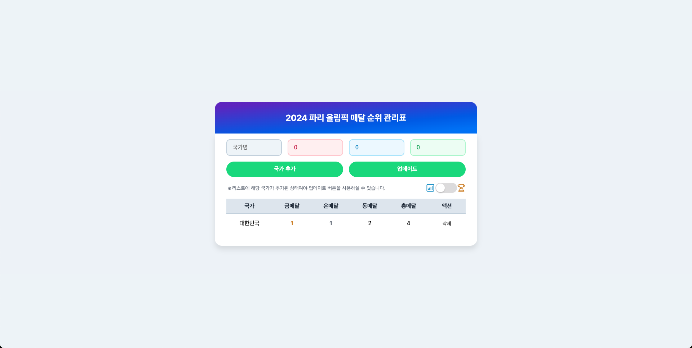
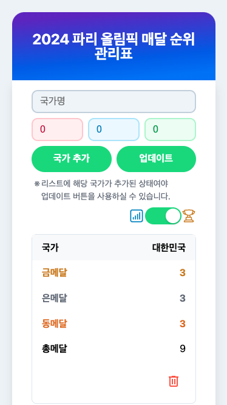

# 🏅 올림픽 메달 관리 시스템

| 데스크탑 메인 화면                                                | 모바일 상세 정보                                                   |
| ----------------------------------------------------------------- | ------------------------------------------------------------------ |
|  |  |

국가별 올림픽 메달 현황을 관리하는 React 기반 웹 애플리케이션입니다.

## 📁 프로젝트 구조

```
project-root/
├── docs/
│   └── images/         # README용 이미지
└── src/
   ├── assets/
   │   └── styles/
   │       ├── button.css
   │       └── input.css
   ├── components/
   │   ├── common/
   │   │   ├── Toggle/
   │   │   │   ├── Toggle.jsx
   │   │   │   └── Toggle.module.css
   │   │   ├── ActionButton.jsx
   │   │   ├── FormButton.jsx
   │   │   ├── InfoText.jsx
   │   │   └── Input.jsx
   │   └── olympic-medals/
   │       ├── MedalInputForm.jsx
   │       ├── MedalInputWrapper.jsx
   │       ├── MedalTableRow.jsx
   │       └── MedalTable.jsx
   ├── layouts/
   │   ├── Header/
   │   │   ├── Header.jsx
   │   │   └── Header.module.css
   │   └── Content.jsx
   ├── pages/
   │   └── OlympicMedalsPage.jsx
   ├── storage/
   │   └── localStorage.js
   ├── App.jsx
   └── main.jsx
```

## ✨ 주요 기능

- 국가 조회/추가/삭제/수정
- 금/은/동메달 관리
- 메달 순위별 정렬
- 데이터 영구 저장
- 반응형 디자인

## 🛠️ 컴포넌트 구성

### 공통 컴포넌트

- `Toggle`: 토글 스위치
- `ActionButton`: 동작 버튼
- `FormButton`: 폼 제출 버튼
- `Input`: 입력 필드
- `InfoText`: 텍스트 표시

### 메달 관리 컴포넌트

- `MedalInputForm`: 메달 데이터 입력 폼
- `MedalInputFormRow`: 국가별 메달 현황 행
- `MedalTable`: 메달 현황 테이블

### 레이아웃 컴포넌트

- `Header`: 헤더 및 네비게이션
- `Content`: 메인 콘텐츠 래퍼
- `OlympicMedalsPage`: 메인 페이지

## 💾 데이터 저장

- localStorage를 활용한 데이터 영구 저장
- 새로고침 후에도 데이터 유지

## 🎨 스타일링

- CSS Modules로 컴포넌트별 스타일 관리
- 버튼과 입력 필드의 전역 스타일 적용
